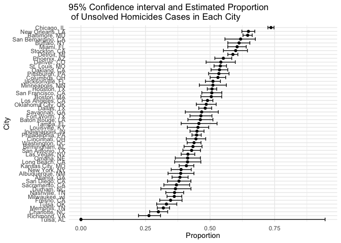
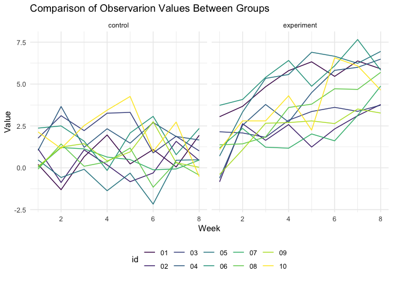

p8105\_hw5\_yw3774
================
Yida Wang
11/12/2021

## problem 1

``` r
url_1 = "https://raw.githubusercontent.com/washingtonpost/data-homicides/master/homicide-data.csv"
homic = read_csv(url_1)
```

    ## Rows: 52179 Columns: 12

    ## ── Column specification ────────────────────────────────────────────────────────
    ## Delimiter: ","
    ## chr (9): uid, victim_last, victim_first, victim_race, victim_age, victim_sex...
    ## dbl (3): reported_date, lat, lon

    ## 
    ## ℹ Use `spec()` to retrieve the full column specification for this data.
    ## ℹ Specify the column types or set `show_col_types = FALSE` to quiet this message.

### summary

This dataset contains 52179 homicides conditions in 50 large U.S. cities
with 12 variables. Missing values exist in victim\_race, victim\_age,
victim\_race, and geographical coordindates. Missing values were changed
to N/A. \* Let’s create a variable contains city and state \* Then
summarize the total number of homicides and unsolved homicides

``` r
city_state_homic = homic %>% 
  unite(city_state, c("city", "state"), sep = ", ") %>% 
  group_by(city_state) %>% 
  summarise(total_homic = n(),
            total_unsolved = sum(disposition %in% c("Closed without arrest", "Open/No arrest")))
knitr::kable(city_state_homic)
```

| city\_state        | total\_homic | total\_unsolved |
|:-------------------|-------------:|----------------:|
| Albuquerque, NM    |          378 |             146 |
| Atlanta, GA        |          973 |             373 |
| Baltimore, MD      |         2827 |            1825 |
| Baton Rouge, LA    |          424 |             196 |
| Birmingham, AL     |          800 |             347 |
| Boston, MA         |          614 |             310 |
| Buffalo, NY        |          521 |             319 |
| Charlotte, NC      |          687 |             206 |
| Chicago, IL        |         5535 |            4073 |
| Cincinnati, OH     |          694 |             309 |
| Columbus, OH       |         1084 |             575 |
| Dallas, TX         |         1567 |             754 |
| Denver, CO         |          312 |             169 |
| Detroit, MI        |         2519 |            1482 |
| Durham, NC         |          276 |             101 |
| Fort Worth, TX     |          549 |             255 |
| Fresno, CA         |          487 |             169 |
| Houston, TX        |         2942 |            1493 |
| Indianapolis, IN   |         1322 |             594 |
| Jacksonville, FL   |         1168 |             597 |
| Kansas City, MO    |         1190 |             486 |
| Las Vegas, NV      |         1381 |             572 |
| Long Beach, CA     |          378 |             156 |
| Los Angeles, CA    |         2257 |            1106 |
| Louisville, KY     |          576 |             261 |
| Memphis, TN        |         1514 |             483 |
| Miami, FL          |          744 |             450 |
| Milwaukee, wI      |         1115 |             403 |
| Minneapolis, MN    |          366 |             187 |
| Nashville, TN      |          767 |             278 |
| New Orleans, LA    |         1434 |             930 |
| New York, NY       |          627 |             243 |
| Oakland, CA        |          947 |             508 |
| Oklahoma City, OK  |          672 |             326 |
| Omaha, NE          |          409 |             169 |
| Philadelphia, PA   |         3037 |            1360 |
| Phoenix, AZ        |          914 |             504 |
| Pittsburgh, PA     |          631 |             337 |
| Richmond, VA       |          429 |             113 |
| Sacramento, CA     |          376 |             139 |
| San Antonio, TX    |          833 |             357 |
| San Bernardino, CA |          275 |             170 |
| San Diego, CA      |          461 |             175 |
| San Francisco, CA  |          663 |             336 |
| Savannah, GA       |          246 |             115 |
| St. Louis, MO      |         1677 |             905 |
| Stockton, CA       |          444 |             266 |
| Tampa, FL          |          208 |              95 |
| Tulsa, AL          |            1 |               0 |
| Tulsa, OK          |          583 |             193 |
| Washington, DC     |         1345 |             589 |

For the city of Baltimore, MD, do the two-side test to get estimated
proportion and 95% confidence interval.

``` r
balt_md = city_state_homic %>% 
  filter(city_state == "Baltimore, MD") 
result_prop = 
  prop.test(x = pull(balt_md, total_unsolved),
            n = pull(balt_md, total_homic)) %>% 
  broom::tidy() %>% 
  select(estimate, conf.low, conf.high)
```

Now for all the cities:

``` r
homicide_all =
  city_state_homic %>% 
  mutate(prop_test = map2(.x = total_unsolved, .y = total_homic, ~prop.test(x = .x, n = .y)),
         tidy_test = map(.x = prop_test, ~broom::tidy(.x))) %>% 
  select(-prop_test) %>% 
  unnest(tidy_test) %>%
  select(city_state, estimate, conf.low, conf.high)
```

Create a plot to show the results:

``` r
homicide_all %>% 
  mutate(
    city_state = fct_reorder(city_state, estimate)
  ) %>%
  ggplot(aes(x = city_state, y = estimate)) +
  geom_point() +
  geom_errorbar(aes(ymin = conf.low, ymax = conf.high)) +
  coord_flip() +
  labs(x = "City",
       y = "Proportion",
       title = "95% Confidence interval and Estimated Proportion \n of Unsolved Homicides Cases in Each City") +
   theme(axis.text.x = element_text(vjust = 0.5, hjust = 0.5))
```

<!-- -->

# problem 2

``` r
data_path = str_c("data/", list.files(path = "data/."))

new_data = tibble(
  files_names = list.files(path = "data/."),
  participants = purrr::map(data_path, read_csv) 
) %>% 
  separate(files_names, into = c("arm","ID"), sep = "_") %>% 
  separate(col = "ID", into = c("id", "csv")) %>%
  mutate(
    arm = recode(arm, con = "control", exp = "experiment" )
    ) %>% 
  select(-csv) %>% 
  unnest(participants) %>%
  pivot_longer(
    week_1:week_8,
    names_to = "week",
    names_prefix = "week_",
    values_to = "observations"
  ) %>% 
  mutate(week = as.numeric(week)) %>%
  mutate(arm = as.factor(arm))
```

    ## Rows: 1 Columns: 8

    ## ── Column specification ────────────────────────────────────────────────────────
    ## Delimiter: ","
    ## dbl (8): week_1, week_2, week_3, week_4, week_5, week_6, week_7, week_8

    ## 
    ## ℹ Use `spec()` to retrieve the full column specification for this data.
    ## ℹ Specify the column types or set `show_col_types = FALSE` to quiet this message.

    ## Rows: 1 Columns: 8

    ## ── Column specification ────────────────────────────────────────────────────────
    ## Delimiter: ","
    ## dbl (8): week_1, week_2, week_3, week_4, week_5, week_6, week_7, week_8

    ## 
    ## ℹ Use `spec()` to retrieve the full column specification for this data.
    ## ℹ Specify the column types or set `show_col_types = FALSE` to quiet this message.

    ## Rows: 1 Columns: 8

    ## ── Column specification ────────────────────────────────────────────────────────
    ## Delimiter: ","
    ## dbl (8): week_1, week_2, week_3, week_4, week_5, week_6, week_7, week_8

    ## 
    ## ℹ Use `spec()` to retrieve the full column specification for this data.
    ## ℹ Specify the column types or set `show_col_types = FALSE` to quiet this message.

    ## Rows: 1 Columns: 8

    ## ── Column specification ────────────────────────────────────────────────────────
    ## Delimiter: ","
    ## dbl (8): week_1, week_2, week_3, week_4, week_5, week_6, week_7, week_8

    ## 
    ## ℹ Use `spec()` to retrieve the full column specification for this data.
    ## ℹ Specify the column types or set `show_col_types = FALSE` to quiet this message.

    ## Rows: 1 Columns: 8

    ## ── Column specification ────────────────────────────────────────────────────────
    ## Delimiter: ","
    ## dbl (8): week_1, week_2, week_3, week_4, week_5, week_6, week_7, week_8

    ## 
    ## ℹ Use `spec()` to retrieve the full column specification for this data.
    ## ℹ Specify the column types or set `show_col_types = FALSE` to quiet this message.

    ## Rows: 1 Columns: 8

    ## ── Column specification ────────────────────────────────────────────────────────
    ## Delimiter: ","
    ## dbl (8): week_1, week_2, week_3, week_4, week_5, week_6, week_7, week_8

    ## 
    ## ℹ Use `spec()` to retrieve the full column specification for this data.
    ## ℹ Specify the column types or set `show_col_types = FALSE` to quiet this message.

    ## Rows: 1 Columns: 8

    ## ── Column specification ────────────────────────────────────────────────────────
    ## Delimiter: ","
    ## dbl (8): week_1, week_2, week_3, week_4, week_5, week_6, week_7, week_8

    ## 
    ## ℹ Use `spec()` to retrieve the full column specification for this data.
    ## ℹ Specify the column types or set `show_col_types = FALSE` to quiet this message.

    ## Rows: 1 Columns: 8

    ## ── Column specification ────────────────────────────────────────────────────────
    ## Delimiter: ","
    ## dbl (8): week_1, week_2, week_3, week_4, week_5, week_6, week_7, week_8

    ## 
    ## ℹ Use `spec()` to retrieve the full column specification for this data.
    ## ℹ Specify the column types or set `show_col_types = FALSE` to quiet this message.

    ## Rows: 1 Columns: 8

    ## ── Column specification ────────────────────────────────────────────────────────
    ## Delimiter: ","
    ## dbl (8): week_1, week_2, week_3, week_4, week_5, week_6, week_7, week_8

    ## 
    ## ℹ Use `spec()` to retrieve the full column specification for this data.
    ## ℹ Specify the column types or set `show_col_types = FALSE` to quiet this message.

    ## Rows: 1 Columns: 8

    ## ── Column specification ────────────────────────────────────────────────────────
    ## Delimiter: ","
    ## dbl (8): week_1, week_2, week_3, week_4, week_5, week_6, week_7, week_8

    ## 
    ## ℹ Use `spec()` to retrieve the full column specification for this data.
    ## ℹ Specify the column types or set `show_col_types = FALSE` to quiet this message.

    ## Rows: 1 Columns: 8

    ## ── Column specification ────────────────────────────────────────────────────────
    ## Delimiter: ","
    ## dbl (8): week_1, week_2, week_3, week_4, week_5, week_6, week_7, week_8

    ## 
    ## ℹ Use `spec()` to retrieve the full column specification for this data.
    ## ℹ Specify the column types or set `show_col_types = FALSE` to quiet this message.

    ## Rows: 1 Columns: 8

    ## ── Column specification ────────────────────────────────────────────────────────
    ## Delimiter: ","
    ## dbl (8): week_1, week_2, week_3, week_4, week_5, week_6, week_7, week_8

    ## 
    ## ℹ Use `spec()` to retrieve the full column specification for this data.
    ## ℹ Specify the column types or set `show_col_types = FALSE` to quiet this message.

    ## Rows: 1 Columns: 8

    ## ── Column specification ────────────────────────────────────────────────────────
    ## Delimiter: ","
    ## dbl (8): week_1, week_2, week_3, week_4, week_5, week_6, week_7, week_8

    ## 
    ## ℹ Use `spec()` to retrieve the full column specification for this data.
    ## ℹ Specify the column types or set `show_col_types = FALSE` to quiet this message.

    ## Rows: 1 Columns: 8

    ## ── Column specification ────────────────────────────────────────────────────────
    ## Delimiter: ","
    ## dbl (8): week_1, week_2, week_3, week_4, week_5, week_6, week_7, week_8

    ## 
    ## ℹ Use `spec()` to retrieve the full column specification for this data.
    ## ℹ Specify the column types or set `show_col_types = FALSE` to quiet this message.

    ## Rows: 1 Columns: 8

    ## ── Column specification ────────────────────────────────────────────────────────
    ## Delimiter: ","
    ## dbl (8): week_1, week_2, week_3, week_4, week_5, week_6, week_7, week_8

    ## 
    ## ℹ Use `spec()` to retrieve the full column specification for this data.
    ## ℹ Specify the column types or set `show_col_types = FALSE` to quiet this message.

    ## Rows: 1 Columns: 8

    ## ── Column specification ────────────────────────────────────────────────────────
    ## Delimiter: ","
    ## dbl (8): week_1, week_2, week_3, week_4, week_5, week_6, week_7, week_8

    ## 
    ## ℹ Use `spec()` to retrieve the full column specification for this data.
    ## ℹ Specify the column types or set `show_col_types = FALSE` to quiet this message.

    ## Rows: 1 Columns: 8

    ## ── Column specification ────────────────────────────────────────────────────────
    ## Delimiter: ","
    ## dbl (8): week_1, week_2, week_3, week_4, week_5, week_6, week_7, week_8

    ## 
    ## ℹ Use `spec()` to retrieve the full column specification for this data.
    ## ℹ Specify the column types or set `show_col_types = FALSE` to quiet this message.

    ## Rows: 1 Columns: 8

    ## ── Column specification ────────────────────────────────────────────────────────
    ## Delimiter: ","
    ## dbl (8): week_1, week_2, week_3, week_4, week_5, week_6, week_7, week_8

    ## 
    ## ℹ Use `spec()` to retrieve the full column specification for this data.
    ## ℹ Specify the column types or set `show_col_types = FALSE` to quiet this message.

    ## Rows: 1 Columns: 8

    ## ── Column specification ────────────────────────────────────────────────────────
    ## Delimiter: ","
    ## dbl (8): week_1, week_2, week_3, week_4, week_5, week_6, week_7, week_8

    ## 
    ## ℹ Use `spec()` to retrieve the full column specification for this data.
    ## ℹ Specify the column types or set `show_col_types = FALSE` to quiet this message.

    ## Rows: 1 Columns: 8

    ## ── Column specification ────────────────────────────────────────────────────────
    ## Delimiter: ","
    ## dbl (8): week_1, week_2, week_3, week_4, week_5, week_6, week_7, week_8

    ## 
    ## ℹ Use `spec()` to retrieve the full column specification for this data.
    ## ℹ Specify the column types or set `show_col_types = FALSE` to quiet this message.

``` r
new_data
```

    ## # A tibble: 160 × 4
    ##    arm     id     week observations
    ##    <fct>   <chr> <dbl>        <dbl>
    ##  1 control 01        1         0.2 
    ##  2 control 01        2        -1.31
    ##  3 control 01        3         0.66
    ##  4 control 01        4         1.96
    ##  5 control 01        5         0.23
    ##  6 control 01        6         1.09
    ##  7 control 01        7         0.05
    ##  8 control 01        8         1.94
    ##  9 control 02        1         1.13
    ## 10 control 02        2        -0.88
    ## # … with 150 more rows

Make a plot for observations

``` r
new_data %>% 
 ggplot(aes(x = week, y = observations, color = id)) +
  facet_grid(. ~ arm) +
  geom_line() +
   labs(
    title = "comparison between groups",
    x = "week",
    y = "value"
    )
```

<!-- -->

From the plot, we can see that from week 1 to week 8, there was a
significant trend of general increase of the observed value in the
experimental group, which is from around 0-3.75 to 3.75-7. However,
there is no significant trend of increase or decrease for the observed
value in the control group as weeks passed. Observed values maintained
around 0 to 2.5 from week 1 to week 8.

# problem 3

``` r
set.seed(10)

iris_with_missing = iris %>% 
  map_df(~replace(.x, sample(1:150, 20), NA)) %>%
  mutate(Species = as.character(Species))
```

-   For numeric variables, you should fill in missing values with the
    mean of non-missing values
-   For character variables, you should fill in missing values with
    “virginica”

``` r
replace = function(x) {
  
  if (is.numeric(x)) {
   x = replace_na(x, mean(x, na.rm = TRUE))
    }
  else if (is.character(x)) {
    x = replace_na(x, "virginica")
  }
}

iris_missing_replace = map(iris_with_missing, replace)

new_iris = iris_missing_replace %>% 
  as_tibble()
```

Check the result

``` r
new_iris %>%
  summarise_all(~ sum(is.na(.)))
```

    ## # A tibble: 1 × 5
    ##   Sepal.Length Sepal.Width Petal.Length Petal.Width Species
    ##          <int>       <int>        <int>       <int>   <int>
    ## 1            0           0            0           0       0
